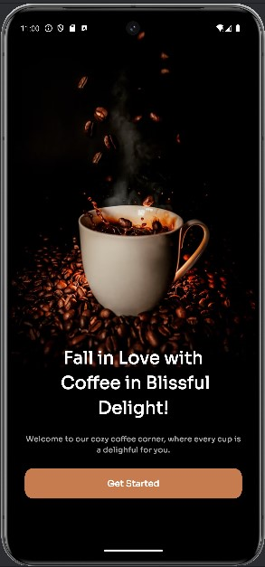
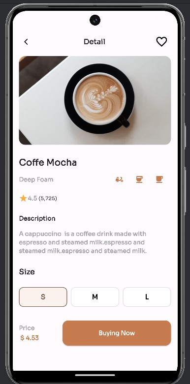

# Coffee Shop App UI ☕

A modern Flutter application UI featuring a high-fidelity coffee shop experience. This project demonstrates responsive layout techniques and custom widget implementation.

## 📱 App Flow & Screenshots

  <kbd>
    
     
    <b>1. Welcome Screen</b>
  </kbd>
  &nbsp;&nbsp;&nbsp;&nbsp;
  <kbd>
    
     
    <b>2. Home (Products)</b>
  </kbd>
  &nbsp;&nbsp;&nbsp;&nbsp;
  <kbd>
    
     
    <b>3. Product Details</b>
  </kbd>

---

## 🛠 Technical Implementation

### 1. Onboarding Screen
- Clean UI with high-resolution background assets.
- Custom "Get Started" button styled for coffee-themed branding.

### 2. Product Dashboard (Home)
- **Responsive Grid:** Uses `MediaQuery` to adapt the product cards to the device width.
- **Star Rating Overlay:** Implemented using `Stack` and `Positioned` to place the rating badge precisely over the image.
- **Category Filtering:** Horizontal scrollable list for coffee types.

### 3. Detail & Description Page
- **Custom AppBar:** A personalized navigation bar for a premium feel.
- **Interactive Sizing:** Toggle system for selecting coffee sizes (S, M, L).
- **Adaptive Spacing:** Used `Flex` and `Expanded` (1:3 ratio) to ensure the price and "Buy Now" button fill the bottom area perfectly without empty spaces.
- **Dynamic Favorite Button:** State-managed heart icon using `setState`.

## 🚀 How to Run
1. Clone this repository.
2. Run `flutter pub get`.
3. Launch on an emulator or physical device.